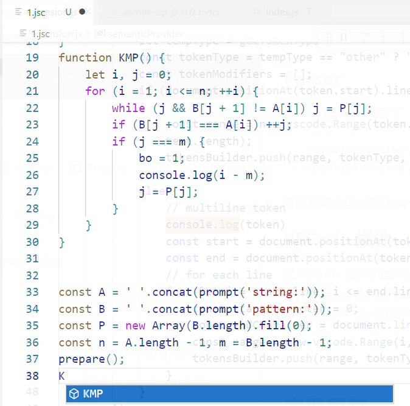
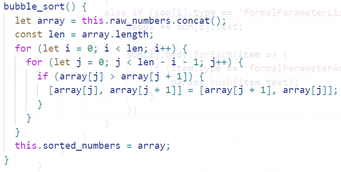
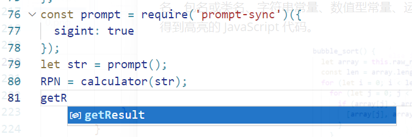
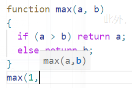

# 编译小组作业 - JavaScript 代码高亮与提示程序

> 和嘉晅 徐浩博 董文冲

## 实现功能

- 使用 antlr 在 Node.js 中实现 JavaScript Lexer 和 JavaScript Parser。
- 实现了一个 VSCode 插件，支持 JavaScript 的代码高亮，自动补全和参数提示功能。

## 使用指南

### Lexer

对于 Windows 系统，在`exe/lexer`目录下，执行：

```sh
..\node16-runtime\nodevars.bat
..\node16-runtime\node.exe index.js < data\calculator.js
```

可以在标准输出看到`data\calculator.js`文件的 token 流。

### Parser

在`exe/parser`目录下，执行 ：

```sh
..\node16-runtime\nodevars.bat
..\node16-runtime\node.exe index.js < data\calculator.js
```

可以在标准输出看到`data\calculator.js`文件的 JSON 格式语法树。

### VSCode 插件

在 VSCode 插件页面中选择`Install From VSIX...`，安装`exe/vscode-lsp-js-0.0.1.vsix`，即可高亮显示 JavaScript 代码。

为了与 VSCode 自带的 JavaScript 语言功能区分，该插件对文件名后缀为`.jsc`而非`.js`的文件有效。



## 实现思路

### JavaScript Lexer/Parser

 我们先参考[antlr](https://github.com/antlr/grammars-v4/blob/master/javascript/javascript/JavaScriptLexer.g4)编写了 JavaScript 的语法（见`JavaScriptLexer.g4`），然后用 antlr 根据编写的语法自动生成可以在 Node.js 环境下运行的 JavaScript Lexer 和 JavaScript Parser，用于后续语言插件的编写。

### 测试用 JavaScript 代码

按照作业文档要求，我们导入语句，类定义与初始化，函数定义及调用，类成员函数调用，字符串常量与数值常量，算术运算符和逻辑运算符，条件判断语句与循环语句 7 个测试代码。这些代码放在`exe/test-workspace/`下，可以用来测试 VSCode 插件的功能。

### VSCode 插件

按照 VSCode [官方教程](https://code.visualstudio.com/api/language-extensions/language-server-extension-guide)的指引，构建一个支持 Language Server Protocol 的简单语言插件。为了不与 VSCode 原生的 JavaScript 冲突，可以利用 VSCode 的`contributes.languages`选项定义一个与 JavaScript 不同的新语言，将以`.jsc`结尾的文件视作一种新语言`custom_javascript`。

### 代码高亮

用 JavaScript Lexer 将代码转化为 token 流后，根据 token type 将不同的词分类为注释、变量名或函数名、包名或类名、字符串常量、数值型常量、运算符、关键字，并为不同的类型选择不同的颜色，即可得到高亮的 JavaScript 代码。



### 代码补全

首先考虑内置函数与变量，若用户输入 token 的前缀匹配到这些内置的关键词则提供补全选项。

此外，用  JavaScript Parser 后将代码中定义的函数，类，变量名也加入补全选项。



### 参数提示

当用户输入函数名和一个左括号时，用 DFS 扫描整个 AST，扫描所有函数定义的树节点，收集代码中的函数定义 ，然后根据用户输入的函数名显示对应的函数定义和参数提示。



## 遇到的问题

### VSCode 插件不支持导入 ES Module

VSCode 插件由于需要兼容 electron，只支持导入 CommonJS 格式的模块（[Support Node's ES Modules · Issue #21457 · electron/electron (github.com)](https://github.com/electron/electron/issues/21457)）。而 antlr4 的 JavaScript runtime 只有 ES Module。

我们使用 JavaScript 翻译器 Babel 将 antlr4 JavaScript runtime 转译成 CommonJS 格式的模块（[@babel/plugin-transform-modules-commonjs · Babel (babeljs.io)](https://babeljs.io/docs/en/babel-plugin-transform-modules-commonjs)）。具体来说，需要安装 babel 和`@babel/plugin-transform-modules-commonjs`模块，然后运行以下命令翻译 antlr4 模块：

```sh
babel antlr4 --out-dir antlr4-cjs --copy-files --plugins @babel/plugin-transform-modules-commonjs
```

之后只需要将`antlr4-cjs`文件夹下所有的`package.json`文件中的`type`改成`commonjs`，即可得到 CommonJS 格式的模块。

## 小组分工

| 人员   | 分工                                                         |
| ------ | ------------------------------------------------------------ |
| 和嘉晅 | VSCode 插件框架探索，VSCode 插件的代码高亮，编写文档         |
| 徐浩博 | 编写测试用的 JavaScript 代码，改进 Parser 格式，VSCode 插件的代码补全、参数提示 |
| 董文冲 | 编写 JavaScript Lexer 和 Parser，并集成到 Node.js 中，VSCode 插件的参数提示 |
